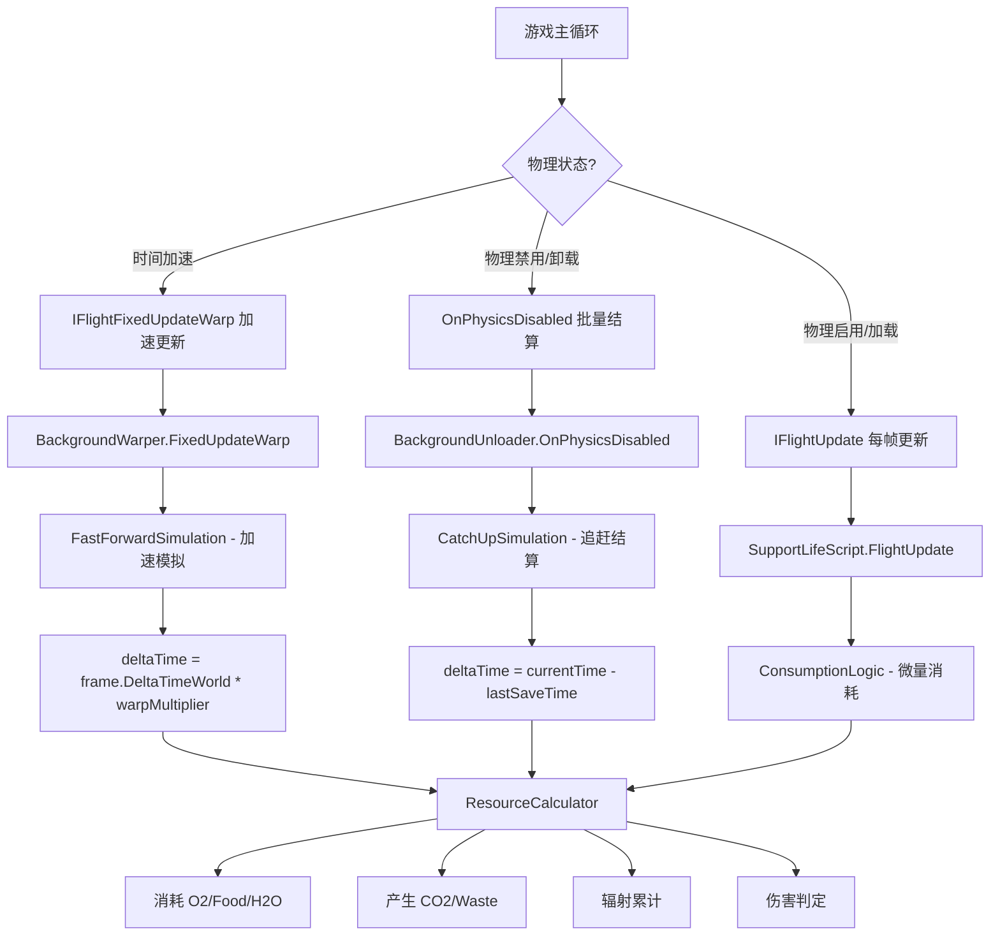

# Kerbalism BackGround 系统移植至 Droodism 可行性分析报告

## 目录
1. [Kerbalism BackGround.cs 源码分析](#1-kerbalism-backgroundcs-源码分析)
2. [Droodism 项目架构分析](#2-droodism-项目架构分析)
3. [游戏本体反编译代码分析](#3-游戏本体反编译代码分析)
4. [关键代码对比](#4-关键代码对比)
5. [兼容性问题与冲突点](#5-兼容性问题与冲突点)
6. [移植工作量估计](#6-移植工作量估计)
7. [建议的集成策略](#7-建议的集成策略)
8. [结论与风险说明](#8-结论与风险说明)

---

## 1. Kerbalism BackGround.cs 源码分析

### 1.1 核心架构

[`BackGround.cs`](C:/renko/unityProjects/Kerbalism/src/Kerbalism/BackGround.cs) 是一个 **静态类** `KERBALISM.Background`，负责在 KSP 中对 **未加载（unloaded）飞船** 进行后台模拟计算。

```
Background.Update(Vessel, VesselData, VesselResources, elapsed_s)
  │
  ├─► Background_PMs(Vessel) ──► 遍历 ProtoPartSnapshots
  │     │                          对每个 ProtoPartModuleSnapshot：
  │     │                            1. 通过 ModuleType() 识别模块类型
  │     │                            2. 若为 Unknown，尝试通过 BackgroundDelegate 反射查找 BackgroundUpdate 方法
  │     │                            3. 返回 List<BackgroundPM>
  │     │                          结果缓存至 Cache.VesselObjectsCache
  │     │
  │     └── 结果缓存：Key="background"，以 Vessel 为键
  │
  └─► 根据 Module_type 分派到具体处理函数
        ├── Reliability.BackgroundUpdate()
        ├── Experiment.BackgroundUpdate()
        ├── Greenhouse.BackgroundUpdate()
        ├── GravityRing.BackgroundUpdate()
        ├── Harvester.BackgroundUpdate()
        ├── Laboratory.BackgroundUpdate()
        ├── ProcessCommand()
        ├── ProcessGenerator()
        ├── ProcessConverter()
        ├── ProcessDrill()
        ├── ProcessStockLab()
        ├── ProcessLight()
        ├── ProcessFissionGenerator()
        ├── ProcessRadioisotopeGenerator()
        ├── ProcessCryoTank()
        ├── ProcessFNGenerator()
        ├── ProcessApiModule() ← 通用 API 入口
        └── ...
```

### 1.2 核心类型

| 类型 | 作用 |
|------|------|
| [`BackgroundDelegate`](C:/renko/unityProjects/Kerbalism/src/Kerbalism/BackGround.cs:11) | 通过反射包装第三方模块的 `BackgroundUpdate` 方法。使用 `MethodInfo.Invoke`（KSP 1.8 前）或 `Func<...>` 委托（KSP 1.8+） |
| [`BackgroundPM`](C:/renko/unityProjects/Kerbalism/src/Kerbalism/BackGround.cs:137) | 数据持有类，包含 `ProtoPartSnapshot`、`ProtoPartModuleSnapshot`、`module_prefab`、`part_prefab`、`Module_type` |
| [`Module_type`](C:/renko/unityProjects/Kerbalism/src/Kerbalism/BackGround.cs:70) | 枚举，定义 24+ 种已知模块类型 + `APIModule` + `Unknown` |
| [`ResourceInfo`](src/Kerbalism/VesselResources.cs) | 资源句柄，提供 `Produce()`、`Consume()` 方法 |
| [`ResourceRecipe`](src/Kerbalism/VesselResources.cs) | 批量资源操作，支持 `AddInput()` / `AddOutput()` |

### 1.3 数据流

```
ProtoPartSnapshots ──► ModuleType() ──► Module_type ──► switch 分发
      │                                            │
      ▼                                            ▼
  ProtoPartModuleSnapshot                  具体处理函数
      │                                            │
      ▼                                            ▼
  Lib.Proto.Get/Set()                         ResourceRecipe
  (读取/写入持久化数据)                          (资源增减)
                                                      │
                                                      ▼
                                              VesselResources
                                              (Produce/Consume/AddRecipe)
```

### 1.4 资源管理模型

- 使用 `availableResources` (`Dictionary<string, double>`) 存储当前所有资源的可用量快照
- 使用 `resourceChangeRequests` (`List<KeyValuePair<string, double>>`) 收集资源变更请求
- API 模块通过 `ResourceBroker` 标识资源流动的来源

### 1.5 线程模型

- **单线程**，运行在 Unity 主线程
- 每次调用 `Update()` 同步处理所有模块
- `Cache.VesselObjectsCache` 提供线程安全（FIFO）的对象缓存
- 无显式锁或并发原语

---

## 2. Droodism 项目架构分析

### 2.1 项目总览

```
Assets/Scripts/
├── Mod.cs                           ← Mod 入口，Harmony 打补丁
├── ModSettings.cs                   ← Mod 设置
├── ModUlti.cs                       ← 工具函数
├── Craft/
│   ├── Fuel/
│   │   └── SRCraftFuelSources.cs    ← 燃料源系统
│   └── Parts/Modifiers/
│       ├── SupportLifeScript.cs     ← 生命维持核心逻辑 (1738行)
│       ├── SupportLifeData.cs       ← 生命维持数据模型
│       ├── PhotoBioReactor*.cs      ← 光生物反应器
│       ├── ChemicalReactor*.cs      ← 化学反应器
│       ├── MiningMachine*.cs        ← 采矿机
│       ├── CrewCabin*.cs            ← 乘员舱
│       ├── GravityRing*.cs          ← 重力环
│       ├── RTGPowerFall*.cs         ← RTG 功率衰减
│       ├── GasDealer*.cs            ← 气体处理
│       ├── ElectrolyticDevice*.cs   ← 电解装置
│       ├── CarbonDeoxideFilter*.cs  ← CO2 过滤
│       ├── Water_Desalination*.cs   ← 水淡化
│       ├── SewageTreatDeivce*.cs    ← 污水处理
│       ├── Sodium_Peroxide*.cs      ← 过氧化钠
│       ├── MethaloxGenerator*.cs    ← 甲烷/氧气发生器
│       ├── LifeSupportGenerator*.cs ← 生命维持发电机
│       ├── Sacrifice*.cs            ← 牺牲机制
│       ├── Balloon*.cs              ← 气球
│       ├── Glider*.cs               ← 滑翔翼
│       ├── Flag*.cs                 ← 旗帜
│       ├── HibernatingChamber*.cs   ← 休眠舱
│       ├── Magnetometer*.cs         ← 磁力计
│       ├── ToolBox*.cs              ← 工具箱
│       ├── ResourceProcessorPartScript.cs ← 资源处理器基类
│       └── ...EditorScripts/        ← 编辑器脚本
│
├── Droodism/
│   ├── BackGround/
│   │   └── BackGround.cs            ← 占位类 (24行, Update 为空)
│   ├── Crew/
│   │   ├── DroodismCrewData.cs
│   │   ├── DroodismCrewDataManager.cs
│   │   └── BreathablePlanets.cs
│   ├── RadiationBelt/
│   │   ├── RadiationBeltManager.cs
│   │   ├── RadiationBeltConfig.cs
│   │   ├── RadiationBeltUI.cs
│   │   └── ...
│   ├── ResourceWarning/
│   │   └── ResourceWarningScript.cs ← 资源警告 (IFlightUpdate)
│   └── UserInterface/
│       ├── DroodismUIManager.cs
│       └── DesignerUI.cs
│
├── HarmonyPatches/
│   ├── AssignCrewPatch.cs
│   ├── CraftPerformanceAnalysisPatch.cs
│   ├── EvaScriptPatch.cs
│   ├── NavBallColorChanger.cs
│   └── ...
```

### 2.2 主循环与组件通信

```
GameLoop (IFlightUpdate / IFlightFixedUpdate / IFlightFixedUpdateWarp)
  │
  ├── SupportLifeScript.FlightUpdate() ← 每帧处理生命维持
  │     ├── ConsumptionLogic()    ← 消耗 O2/Food/H2O，产生 CO2/Waste
  │     ├── AutoRefillLogic()     ← 从 Craft 燃料源补充
  │     ├── CheckRadiationState() ← 辐射状态检查
  │     ├── DamageRadiation()     ← 辐射伤害
  │     └── PilotDamageReduction()
  │
  ├── ResourceWarningScript.FlightUpdate() ← 资源警告
  │
  ├── DroodismCrewDataManager (MonoBehaviour)
  │
  └── RadiationBeltManager (MonoBehaviour)
```

### 2.3 资源系统模型

Droodism 的资源系统基于 **双缓冲模型**：

```
┌──────────────────────────────────────────────────┐
│               Craft FuelSource                    │
│  (IFuelSource: OxygenSource, WaterSource, ...)   │
│   AddFuel() / RemoveFuel() / TotalFuel           │
└──────────────────────┬───────────────────────────┘
                       │ Sync (TrySyncPair)
                       ▼
┌──────────────────────────────────────────────────┐
│          Local Buffer (SupportLifeData)           │
│  _oxygenAmountBuffer / _foodAmountBuffer / ...   │
│  用于 EVA 模式下的人物本地存储                      │
└──────────────────────────────────────────────────┘
```

### 2.4 主循环接口（游戏 API 提供）

| 接口 | 触发时机 | 用途 |
|------|----------|------|
| [`IFlightUpdate`](C:/renko/shitProgram/jnoCode/ModApi/GameLoop/Interfaces/IFlightUpdate.cs:6) | 每帧 | 视觉/逻辑更新 |
| [`IFlightFixedUpdate`](C:/renko/shitProgram/jnoCode/ModApi/GameLoop/Interfaces/IFlightFixedUpdate.cs:6) | 物理步长 | 物理模拟 |
| [`IFlightFixedUpdateWarp`](C:/renko/shitProgram/jnoCode/ModApi/GameLoop/Interfaces/IFlightFixedUpdateWarp.cs:6) | 时间加速时 | 加速时的物理 |
| [`IFlightStart`](C:/renko/shitProgram/jnoCode/ModApi/GameLoop/Interfaces/IFlightStart.cs:6) | 飞行开始 | 初始化 |
| `IFlightUpdateParallel` | 并行帧 | 并行逻辑 |
| `IFlightFixedUpdateParallel` | 并行物理 | 并行物理 |
| `IFlightUpdatePaused` | 暂停时 | 暂停时更新 |

### 2.5 时间系统

[`FlightFrameData`](C:/renko/shitProgram/jnoCode/ModApi/GameLoop/FlightFrameData.cs:8):

```csharp
public readonly struct FlightFrameData {
    public readonly float DeltaTime;           // Time.deltaTime
    public readonly double DeltaTimeWorld;     // 游戏世界时间增量（含时间加速）
    public readonly bool IsPaused;
    public readonly bool IsWarping;
    public readonly ITimeManager TimeManager;
}
```

### 2.6 物理状态变化

[`PhysicsChangeReason`](C:/renko/shitProgram/jnoCode/ModApi/Flight/GameView/PhysicsChangeReason.cs:6):

```csharp
public enum PhysicsChangeReason {
    FlightEnd,
    LoadedIntoGameView,
    LoadPhysics,
    UnloadedFromGameView,
    UnloadPhysics,
    Warp
}
```

---

## 3. 游戏本体反编译代码分析

### 3.1 游戏循环系统

从反编译代码分析，SR2 的游戏循环提供以下机制：

- **注册方式**：`Game.Instance.FlightScene.GameLoop.Register(this)` / `Unregister(this)`
- **帧数据结构**：`FlightFrameData` 包含 DeltaTime、DeltaTimeWorld、IsPaused、IsWarping
- **时间管理器**：`ITimeManager` 控制时间模式、暂停/恢复、时间倍率

### 3.2 后台处理机制对比

| 特征 | KSP | SimpleRockets 2 |
|------|-----|-----------------|
| 未加载飞船 | 保留在轨道上，可模拟 | 去负载后移除物理 |
| 后台模拟 | Background 系统 | 无原生支持 |
| 时间加速 | Warp 时调用 Background Update | `IFlightFixedUpdateWarp` |
| 资源系统 | ResourceInfo / ResourceRecipe | IFuelSource 接口 |
| 模块持久化 | ProtoPartModuleSnapshot | PartModifierData (SerializeField) |

### 3.3 资源系统差异

**Kerbalism (KSP)：**
- 资源由 `PartResource` 管理，全局 `ResourceMap` 可查询丰度
- `VesselResources` 提供 Produce/Consume/AddRecipe
- `ResourceBroker` 跟踪资源流动来源

**Droodism (SR2)：**
- 资源通过 `IFuelSource` 接口管理
- 燃料源绑定到特定零件（STCommandPodPatch）
- 双缓冲：Craft FuelSource + Local Buffer
- 无全局资源管理器

---

## 4. 关键代码对比

### 4.1 核心入口对比

**Kerbalism** - 静态类，外部调用：
```csharp
// Kerbalism.BackGround.cs:149
public static void Update(Vessel v, VesselData vd, VesselResources resources, double elapsed_s)
{
    if (!Lib.IsVessel(v)) return;
    // ... 遍历 ProtoPartSnapshots
}
```

**Droodism 现有** - 空占位：
```csharp
// Droodism/BackGround/BackGround.cs:7
public class BackGroundCalulator : MonoBehaviourBase
{
    private void Update()
    {
        if (!Game.InFlightScene) return;
        // 空的！
    }
}
```

### 4.2 模块发现机制对比

**Kerbalism** - 反射 + 硬编码分派：
```csharp
// Kerbalism.BackGround.cs:101
public static Module_type ModuleType(string module_name)
{
    switch (module_name)
    {
        case "Reliability": return Module_type.Reliability;
        case "Habitat": return Module_type.Habitat;
        // ... 24+ 种类型
    }
    return Module_type.Unknown;
}
```

**Droodism** - 直接通过 PartModifierData 引用：
```csharp
// 无需反射，直接获取
var supportLifeData = pd.GetModifier<SupportLifeData>();
var supportLifeScript = supportLifeData.Script;
```

### 4.3 资源消耗逻辑对比

**Kerbalism** - 统一资源管理：
```csharp
// Kerbalism.BackGround.cs:296
foreach (ModuleResource ir in command.resHandler.inputResources)
{
    resources.Consume(v, ir.name, ir.rate * elapsed_s, ResourceBroker.Command);
}
```

**Droodism** - 双缓冲模式：
```csharp
// SupportLifeScript.cs:625
private bool ConsumeInputResource(IFuelSource craftSource, ref double localSourceAmount, 
    double amount, in FlightFrameData frame, float damageScale, string fuelTypeName)
{
    if (craftSource == null || craftSource.IsEmpty)
    {
        if (localSourceAmount > 0) { /* 消耗本地缓存 */ }
        else { DamageDrood(...); return false; }
    }
    if (craftSource != null && !craftSource.IsEmpty)
        craftSource.RemoveFuel(amount);
    return true;
}
```

### 4.4 数据结构对比

**Kerbalism BackgroundPM:**
```csharp
internal class BackgroundPM
{
    internal ProtoPartSnapshot p;
    internal ProtoPartModuleSnapshot m;
    internal PartModule module_prefab;
    internal Part part_prefab;
    internal Module_type type;
}
```

**Droodism** - 无需类似结构，数据直接存储在 PartModifierData 中：
```csharp
// SupportLifeData 通过 [SerializeField] [PartModifierProperty] 持久化字段
[SerializeField] [PartModifierProperty]
public double _oxygenAmountBuffer = 0f;
```

### 4.5 线程同步对比

**Kerbalism:** 无显式同步，假设在 Unity 主线程调用，使用 `Cache.VesselObjectsCache` 作为线程安全的 LRU 缓存。

**Droodism:** 同样运行在主线程，通过 Unity 的 MonoBehaviour 生命周期管理。无需额外同步。

---

## 5. 兼容性问题与冲突点

### 5.1 核心架构差异（严重）

| 问题 | 说明 | 严重程度 |
|------|------|----------|
| **无"未加载飞船"概念** | SR2 在物理范围外不保留飞船状态 | 🔴 致命 |
| **资源系统完全不同** | Kerbalism 使用 VesselResources；Droodism 使用 IFuelSource + Buffer | 🔴 致命 |
| **模块系统不同** | KSP 的 PartModule 继承体系 vs SR2 的 PartModifierData/PartModifierScript | 🟡 中等 |
| **Proto 快照系统** | SR2 无 ProtoPartSnapshot 等价物（数据通过 SerializeField 持久化） | 🟡 中等 |

### 5.2 API 假设冲突（中等）

| Kerbalism 假设 | Droodism/SR2 实际情况 |
|---------------|----------------------|
| `PartLoader.getPartInfoByName()` | 无等价 API，使用 `PartType` 系统 |
| `Planetarium.GetUniversalTime()` | 使用 `FlightSceneScript.Instance.FlightState.Time` |
| `Vessel.protoVessel.protoPartSnapshots` | 使用 `CraftScript.Data.Assembly.Parts` |
| `ResourceMap.Instance.GetAbundance()` | 无等价物，需通过 `IPlanetNode.PlanetData` 间接获取 |
| `ProtoPartModuleSnapshot` 存储状态 | 使用 `PartModifierData` 的 `[SerializeField]` 字段 |

### 5.3 生命周期管理冲突（中等）

Kerbalism 的 Background 系统期望在以下时机被调用：
1. 飞船未加载但仍在物理范围内时定期调用
2. 时间加速（warp）时调用
3. 加载/卸载过渡时调用

Droodism/SR2 中：
1. 物理禁用时触发 `OnPhysicsDisabled()` → 可在此处批量结算
2. warp 时触发 `IFlightFixedUpdateWarp` → 可用于加速模拟
3. 加载/卸载时 `OnCraftLoaded()` / `OnCraftUnloaded()` → 可用于状态保存

### 5.4 性能考虑

- Kerbalism 的后台更新是 **批处理** 的（一个大时间步长内计算所有模块）
- Droodism 当前是 **逐帧** 的（每帧消耗微量资源）
- 移植后需要确保后台结算不会造成帧率尖峰
- 反射调用（Kerbalism 的 `BackgroundDelegate`）在 SR2 中可以用泛型/接口替代

---

## 6. 移植工作量估计

### 6.1 需要创建的模块

| 模块 | 估计行数 | 说明 |
|------|---------|------|
| [`BackGroundCalculator` 改造](Assets/Scripts/Droodism/BackGround/BackGround.cs) | ~300 | 从空占位改为实现 `IFlightFixedUpdateWarp` |
| `BackgroundUnloadSimulator` | ~500 | 处理飞船物理禁用时的批量资源结算 |
| `ResourceBroker` 适配层 | ~200 | 将 Kerbalism 的 ResourceBroker 概念适配到 SR2 |
| `UnloadedVesselStateManager` | ~400 | 管理未加载飞船的状态持久化 |
| `BackgroundModuleRegistry` | ~300 | 模块注册与发现机制（替代反射） |

### 6.2 需要修改的模块

| 模块 | 修改内容 | 估计改动量 |
|------|---------|-----------|
| [`SupportLifeScript`](Assets/Scripts/Craft/Parts/Modifiers/SupportLifeScript.cs) | 添加 `BackgroundUpdate()` 静态方法；分离帧更新和批量更新逻辑 | 中等 (~200行) |
| [`SupportLifeData`](Assets/Scripts/Craft/Parts/Modifiers/SupportLifeData.cs) | 添加时间戳字段以支持增量结算 | 小 (~30行) |
| [`Mod.cs`](Assets/Scripts/Mod.cs) | 注册新的 GameLoop 组件 | 小 (~10行) |
| [`DroodismCrewDataManager`](Assets/Scripts/Droodism/Crew/DroodismCrewDataManager.cs) | 添加后台兼容的船员数据访问 | 小 (~50行) |

### 6.3 需要新增的适配层

| 适配层 | 作用 | 估计行数 |
|--------|------|---------|
| `VesselResourcesAdapter` | 将 Kerbalism 的资源 API 适配到 SR2 的 IFuelSource | ~300 |
| `ProtoSnapshotAdapter` | 模拟 ProtoPartSnapshot 访问模式 | ~200 |
| `TimeAdapter` | 统一时间系统访问 | ~50 |
| `CrewAdapter` | 统一船员数据访问 | ~100 |

### 6.4 总计工作量估计

| 类别 | 估计行数 | 估计工时 |
|------|---------|---------|
| 新建模块 | ~1700 | 中 |
| 修改模块 | ~300 | 小 |
| 适配层 | ~650 | 中 |
| 测试与调试 | - | 大 |
| **总计** | **~2650 行** | **中-大** |

---

## 7. 建议的集成策略

### 7.1 推荐方案：逐步替换（Step-by-Step Replacement）

鉴于两个游戏的架构差异过大，建议 **不直接移植 Kerbalism 代码**，而是 **借鉴其核心概念**，重新在 SR2 框架上实现。

#### Phase 1：基础设施（~1-2周）
1. 改造 [`BackGroundCalulator`](Assets/Scripts/Droodism/BackGround/BackGround.cs) 实现 `IFlightFixedUpdateWarp` 接口
2. 实现物理禁用时的批量资源结算（利用 `OnPhysicsDisabled` 事件）
3. 添加时间戳追踪，记录上次结算时间

#### Phase 2：核心逻辑（~2-3周）
1. 实现增量时间资源消耗算法（将 Kerbalism 的 `elapsed_s` 参数应用到 SR2 的消耗率）
2. 重构 [`ConsumptionLogic()`](Assets/Scripts/Craft/Parts/Modifiers/SupportLifeScript.cs:589) 使其支持任意时间步长
3. 实现 [`RemoveFuelAmountInstantly()`](Assets/Scripts/Craft/Parts/Modifiers/SupportLifeScript.cs:708) 的优化版本

#### Phase 3：集成与测试（~1-2周）
1. 连接 ResourceWarning 系统与新后台计算系统
2. 压力测试：长时间 warp、频繁加载/卸载
3. 边界情况处理：资源耗尽、休眠状态切换

### 7.2 备选方案：封装适配（Wrapper Adaptation）

创建一个适配层 [`KerbalismBackgroundAdapter`] 将 Kerbalism 的背景计算逻辑封装起来，通过适配器桥接到 SR2 API。

**优点**：代码复用度高  
**缺点**：适配层复杂度高，可能引入难以调试的间接性

### 7.3 不推荐方案：直接重构

将 Droodism 的整个资源系统改为 Kerbalism 的模型（使用 VesselResources 风格），风险过高，可能导致现有功能大规模退化。

### 7.4 Mermaid 流程图



---

## 8. 结论与风险说明

### 最终结论：条件可行 ✅

### 判断依据

| 维度 | 评分 | 说明 |
|------|------|------|
| 核心概念兼容性 | 🟡 中等 | 后台模拟理念可借鉴，但架构差异大 |
| 代码可复用性 | 🔴 低 | 直接复制代码不可行，API 完全不同 |
| 架构可行性 | 🟢 高 | SR2 的 GameLoop 接口提供足够扩展点 |
| 性能可行性 | 🟢 高 | 增量/批量结算性能开销可控 |
| 维护性 | 🟡 中等 | 新系统需额外维护，但比现有乱码注释更可维护 |

### 风险说明

| 风险 | 等级 | 缓解措施 |
|------|------|---------|
| **物理禁用事件不可靠** | 🟡 中 | 添加 fallback 检查，在每次物理启用时校验 |
| **warp 时资源消耗不匹配** | 🟡 中 | 使用 `FlightState.Time` 确保时间连续性 |
| **现有代码耦合度高** | 🔴 高 | [`SupportLifeScript.cs`](Assets/Scripts/Craft/Parts/Modifiers/SupportLifeScript.cs) 1738 行紧密耦合的代码需要小心重构 |
| **休眠状态复杂度** | 🟡 中 | 休眠时暂停消耗，苏醒时追赶结算需注意边界 |
| **多人/多飞船场景** | 🟢 低 | SR2 当前为单人游戏，暂时无并发问题 |
| **游戏版本更新 API 变化** | 🟡 中 | 依赖 `ModApi.Flight.GameView.PhysicsChangeReason` 等反编译确定的接口 |

### 关键建议

1. **不要直接复制代码** - Kerbalism 的代码与 KSP API 深度绑定，直接复制会导致大量编译错误
2. **复用概念而非代码** - 借鉴其模块化设计思路（Module_type 枚举、switch 分发、增量时间计算）
3. **保持现有资源系统** - 不要重构 IFuelSource / 双缓冲模型，改为在顶层添加后台结算层
4. **逐步迭代** - 先实现最简单的 warp 追赶逻辑，再逐步优化
5. **注释依然是中文** - 虽然现有代码注释风格粗犷，但保留中文注释便于维护

### 最终建议

**建议采用"逐步替换"策略，借鉴 Kerbalism 的后台模拟概念，但在 SR2 框架上重新实现。** 不需要逐行移植代码，只需理解其核心算法（增量时间步长资源消耗）和模块组织方式（按模块类型分派），然后直接在 Droodism 的 GameLoop 体系上实现。

当前 [`BackGroundCalulator`](Assets/Scripts/Droodism/BackGround/BackGround.cs) 占位类恰好是理想的切入点，实现 `IFlightFixedUpdateWarp` 接口即可在 warp 时获得后台更新机会。现有 [`OnPhysicsDisabled`](Assets/Scripts/Craft/Parts/Modifiers/SupportLifeScript.cs:326) 和 [`RemoveFuelAmountInstantly()`](Assets/Scripts/Craft/Parts/Modifiers/SupportLifeScript.cs:708) 已经是后台结算的雏形，只需将其标准化和通用化。

> **一言以蔽之**：Kerbalism 的 Background 系统提供了"如何做"（模块化后台模拟）的思路，但 Droodism 需要自己重新实现"在哪里做"（GameLoop 集成）和"怎么做"（资源系统适配）。
